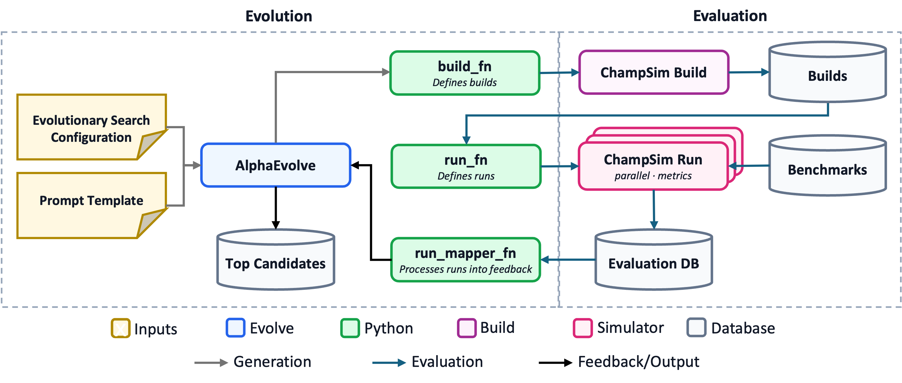

Agentic Architectural Discovery with Evolutionary Coding Agents
================================================================

A CHIA case study that sets up an agentic discovery flow using evolutionary coding agents 
to discover novel hardware data prefetchers for `ChampSim <https://github.com/ChampSim/ChampSim>`_
— a widely-used microarchitectural simulator for memory system research.
The full flow lives in the `evolve-flows <https://github.com/ucb-bar/evolve-flows/tree/main>`_
repository under ``examples/alphaevolve-champsim-simple``.

Overview
--------
Architects spend significant amounts of time and resources in designing microarchitectural blocks such as data prefetchers, cache replacement policies, and branch predictors to extract performance gains in a processor. 
Recently, ArchAgent [#archagent]_ demonstrated the ability of evolutionary coding agents to automatically discover novel cache replacement policies for last-level caches in processors in a matter of days. These discovered policies were more performant and discovered much faster than prior human-designed state-of-the-art policies.

However, designing, debugging, and operating such flows comes with significant user burden. This case study demonstrates how CHIA addresses these challenges.
It implements and deploys a complete ArchAgent-like evolutionary discovery flow for prefetcher discovery — from AlphaEvolve-driven candidate generation through parallel ChampSim evaluation — in a small amount of
code by composing CHIA's library nodes. The flow is designed to be a starting
point: the same pattern scales to more sophisticated evaluation cascades
(RTL simulation, FPGA emulation, physical design) using CHIA's extensible
node library.

A hardware data prefetcher is a microarchitectural block that predicts which cache lines a program will access next
and fetches them before they are needed, hiding memory latency. Designing a good
prefetcher is hard as prefetches must be accurate and timely while covering a substantial portion of the program's memory accesses to derive meaningful gains.
Different workloads exhibit different access patterns (stride,
pointer-chasing, spatial, temporal), and a prefetcher that helps one workload may
hurt another by polluting the cache with useless lines. IPC (instructions per cycle) is an end-to-end metric capturing a given application's performance on a processor. The standard metric to evaluate prefetchers is
**geomean IPC** across a suite of benchmarks where higher is better.

``alphaevolve-champsim-simple`` automates prefetcher design as an evolutionary
discovery loop. In each iteration:

#. an evolutionary coding agent proposes a candidate C++ prefetcher module (a ``struct`` implementing
   the ChampSim prefetcher API),
#. the candidate is **compiled** into a ChampSim binary on a dedicated build
   worker,
#. the binary is **run in parallel** against a suite of benchmark traces — one
   run per trace, fanned out across a pool of simulation workers, and
#. a **result mapper** aggregates per-trace IPC into a single fitness score
   (geomean IPC) that feeds back to the evolutionary search.

.. note:: **Goal**

   This case study showcases CHIA's ability to compose evolutionary discovery
   flows from reusable building blocks. The ``EvolverNode`` wraps various evolutionary coding agents; 
   the ``ChampSimNode`` handles build and simulation of candidates; the cluster
   config manages worker lifecycle and resource scheduling. The same three-function
   interface (``build_fn``, ``run_fn``, ``result_mapper_fn``) plugs into any CHIA
   evaluator backend, so swapping the simulator — or the evolutionary agent — is
   a small configuration and code edit, not a complete rewrite.

How it works
------------

The evolutionary discovery loop
~~~~~~~~~~~~~~~~~~~~~~~~~~~~~~~

Each iteration of the flow generates a candidate C++ prefetcher, compiles it
into a ChampSim simulator, runs it against a set of benchmark traces in parallel, and feeds the
aggregated performance metrics back as a fitness score. The loop repeats until a stopping
criterion is met (iteration limit, manual stop, or convergence).

   Architecture of the evolutionary prefetcher discovery loop. The evolution
   side generates candidates using an evolutionary coding agent such as
   AlphaEvolve and receives fitness feedback; the evaluation side compiles each
   candidate, runs it against benchmark traces in parallel, and aggregates
   metrics into fitness feedback.

.. note:: **Simplified example**

   This example is a scaled down version of the flow described in ArchAgent: 3 SPEC CPU 2017 ChampSim traces, 5
   simulation workers, and 10 search iterations — enough to demonstrate the
   architecture and see IPC improvements in under an hour. 

The three-function evaluator interface
~~~~~~~~~~~~~~~~~~~~~~~~~~~~~~~~~~~~~~~~

The heart of the CHIA integration is the ``ChiaEvaluator``, which defines the
flow's evaluation pipeline through three functions. This same interface is used
by all CHIA evolutionary discovery flows, regardless of the underlying
simulator:

- **build_fn** — takes a candidate program (source code) and produces a compiled
  artifact. Here it dispatches a ChampSim build onto a ``champsim_build`` worker:

  .. code-block:: python

      def _build(self, program_solution: str) -> Any:
          return self._build_node.build_champsim.options(
              resources={"champsim_build": 1.0},
              num_cpus=8,
          ).chia_remote(
              self._champsim_root,
              program_solution,
              self._module_name,
              cache_level=self._cache_level,
              timeout_s=1800,
              incremental=True,
          )

- **run_fn** — takes the compiled binary and a workload, then runs the
  simulation. Each trace is dispatched to a separate ``champsim`` worker, so
  traces run in parallel up to the cluster's worker count:

  .. code-block:: python

      def _run(self, *, workload: str) -> Any:
          binary = _eval_binary.get()
          return self._run_node.run_champsim.chia_remote(
              binary=binary,
              trace=workload,
              warmup_instructions=self._warmup,
              simulation_instructions=self._sim_instr,
              timeout_s=3600,
          )

- **result_mapper_fn** — transforms raw simulator output into the metrics dict
  the search backend consumes. For ChampSim this extracts IPC, MPKI, prefetch
  accuracy, and coverage, then computes a geometric mean IPC as the combined
  fitness score.

The ``ChiaEvaluator`` orchestrates these three functions: it calls ``build_fn``
once per candidate, fans out ``run_fn`` across all configured workloads in
parallel via CHIA's resource scheduler, collects the results, and calls
``result_mapper_fn`` to produce the score. Build failures (invalid C++ is
expected from LLM-generated code) score ``0.0`` and the search continues —
the evaluator never crashes on a bad candidate.

EvolverNode: pluggable evolutionary agents
~~~~~~~~~~~~~~~~~~~~~~~~~~~~~~~~~~~~~~~~~~~~

The ``EvolverNode`` wraps `SkyDiscover <https://github.com/ucb-bar/SkyDiscover>`_
— a flexible framework for AI-driven scientific and algorithmic discovery with
support for evolutionary coding agents such as AdaEvolve, OpenEvolve, EvoX, and
GEPA. CHIA adds an `AlphaEvolve <https://deepmind.google/discover/blog/alphaevolve-a-gemini-powered-coding-agent-for-designing-advanced-algorithms/>`_
backend via the AlphaEvolve Google Cloud API. The ``search.type`` field in the
config YAML selects which agent drives candidate generation; the evaluation
pipeline stays the same regardless.

Distributing work across the cluster
~~~~~~~~~~~~~~~~~~~~~~~~~~~~~~~~~~~~~~

The cluster uses three logical worker types, each tagged with a custom CHIA
resource so the scheduler routes tasks to the right container:

.. list-table::
   :header-rows: 1
   :widths: 18 14 68

   * - Node type
     - Workers
     - Role
   * - ``champsim_build``
     - 1
     - compiles candidates into ChampSim binaries (Docker, 8 CPUs,
       ``champsim_build`` resource)
   * - ``champsim``
     - 5
     - runs simulations against traces in parallel (Docker, ``champsim``
       resource); one trace per worker
   * - ``evolver``
     - 1
     - hosts the ``EvolverNode`` Ray actor that drives the search loop
       (conda, ``evolver`` resource)

The build worker is pinned to 8 CPUs (``--cpuset-cpus=0-7``) for fast
compilation. The five run workers execute traces concurrently — with three
traces per iteration, all three run in parallel with two workers spare for the
next iteration's overlap.

Each ``ChampSimNode`` is created with ``require_colocated=False``, meaning builds
and runs are dispatched to **any** available worker with the required resource,
not pinned to a specific container. CHIA's resource scheduler handles the
assignment:

.. code-block:: python

    build_node = ChampSimNode(require_colocated=False)
    run_node = ChampSimNode(require_colocated=False)

The ``EvolverNode`` itself is a **detached** Ray actor — it survives the
launching process, which enables the ``stop`` and ``status`` subcommands to
connect from a separate terminal and interact with a running search. This is a
standard Ray pattern that CHIA leverages for long-running search lifecycle
management:

.. code-block:: python

    evolver = EvolverNode.options(
        name="adaevolve-prefetcher-simple-evolver",
        lifetime="detached",
        resources={"evolver": 1.0},
        runtime_env=RUNTIME_ENV,
    ).remote()

The seed program
~~~~~~~~~~~~~~~~~~

The search starts from a **seed program** — a minimal next-line prefetcher that
prefetches the cache line immediately following each L2C access. This gives the
search a non-zero baseline IPC to improve upon, and ensures the first iteration
exercises the full build → run → map pipeline before the LLM generates any
candidates:

.. code-block:: cpp

    #include <cstdint>
    #include "address.h"
    #include "modules.h"

    struct evolved_pf : public champsim::modules::prefetcher {
      using prefetcher::prefetcher;

      uint32_t prefetcher_cache_operate(champsim::address addr, champsim::address ip,
                                         uint8_t cache_hit, bool useful_prefetch,
                                         access_type type, uint32_t metadata_in) {
        champsim::block_number pf_addr{addr};
        prefetch_line(champsim::address{pf_addr + 1}, true, metadata_in);
        return metadata_in;
      }

      uint32_t prefetcher_cache_fill(champsim::address addr, long set, long way,
                                      uint8_t prefetch, champsim::address evicted_addr,
                                      uint32_t metadata_in) {
        return metadata_in;
      }
    };

The system prompt (shared by both search backends) describes the ChampSim
prefetcher API, optimization objectives (IPC, prefetch accuracy, coverage,
MPKI), and techniques to explore (stride detection, spatial locality, temporal
correlation, best-offset, Markov chains, adaptive throttling). The LLM is
constrained to pure C++17 with no external libraries.

Setup
-----

These steps apply to both search backends. Run them from the example directory
(``examples/alphaevolve-champsim-simple``) unless noted.

**1. Prerequisites** — this flow requires:

- A conda environment with ``chia`` installed
- ChampSim traces for your benchmarks of choice. We use 3 SPEC17 traces from
  the `4th Data Prefetching Championship (DPC-4) trace collection
  <https://console.cloud.google.com/storage/browser/dpc4-all-traces>`_.
- AlphaEvolve prerequisites:

  - a GCP project with AlphaEvolve enabled and a Gemini Enterprise license (trial available) — we suggest working
    through the `Install and Configure AlphaEvolve <https://docs.cloud.google.com/gemini/enterprise/docs/alphaevolve/developer-guide/get-started>`_ page
  - a gcloud credentials file: run ``gcloud auth application-default login``

- AdaEvolve prerequisites:

  - an LLM API key (Gemini, OpenAI, Anthropic, DeepSeek, Mistral, or Cohere)

**2. Install evolve-flows** — clone the `evolve-flows
<https://github.com/ucb-bar/evolve-flows>`__ repository and install it along
with SkyDiscover into your conda environment:

.. code-block:: bash

    git clone --recurse-submodules git@github.com:ucb-bar/evolve-flows.git
    cd evolve-flows
    conda activate your_env
    pip install -e ./skydiscover
    pip install -e .

**3. Configure traces and output** — in ``run_flow.py``, update ``TRACE_DIR``
to point at the directory containing your trace files, set the ``WORKLOADS``
list to the traces you want to evaluate against, and optionally update
``DEFAULT_OUTPUT_BASE`` to your desired output location:

.. code-block:: python

    TRACE_DIR = "/path/to/traces"
    WORKLOADS = [
        os.path.join(TRACE_DIR, "trace_1.champsimtrace.xz"),
        os.path.join(TRACE_DIR, "trace_2.champsimtrace.xz"),
        os.path.join(TRACE_DIR, "trace_3.champsimtrace.xz"),
    ]
    DEFAULT_OUTPUT_BASE = "./results"

We use a single-server cluster for this case study. For a multi-server cluster, we recommend using a networked file system or a CHIA database node for these directories for simplicity.

The simulation parameters (5M warmup + 25M simulation instructions per trace)
are set in the same file and can be adjusted for longer or shorter runs.

**4. Cluster config** — in ``cluster.yaml``, set ``provider.head_ip`` to your
head machine's hostname or IP, and update ``compatible_ips`` for each node type
to list the machines those workers should run on. Update the ``auth`` section
with your SSH credentials:

.. code-block:: yaml

    provider:
        head_ip: your-head-machine

    auth:
        ssh_user: your-username
        ssh_private_key: /path/to/your/ssh/key

    available_node_types:
        champsim_build:
            compatible_ips: [your-head-machine]
            docker:
                image: "ghcr.io/ucb-bar/chia-champsim:latest"
                pull_before_run: true
                run_options:
                    - -v /path/to/traces:/path/to/traces:ro
            # ...
        champsim:
            compatible_ips: [your-head-machine]
            docker:
                image: "ghcr.io/ucb-bar/chia-champsim:latest"
                pull_before_run: true
                run_options:
                    - -v /path/to/traces:/path/to/traces:ro
            # ...
        evolver:
            compatible_ips: [your-head-machine]
            # ...

All three worker types can run on a single machine. The ``champsim_build`` and
``champsim`` workers use the ``ghcr.io/ucb-bar/chia-champsim:latest`` Docker
image, which ``chia up`` pulls automatically (``pull_before_run: true``). Update
the ``-v`` run option to mount your trace directory into the containers. See
:doc:`/user_guides/cluster_config_reference` for the full schema.

**5. Bring up the cluster**:

.. code-block:: bash

    conda activate your_env
    cd /path/to/evolve-flows
    chia up examples/alphaevolve-champsim-simple/cluster.yaml

Verify at the Ray dashboard (``http://<head>:8265``) — you should see 7 workers
with resources ``champsim_build: 1``, ``champsim: 5``, ``evolver: 1``.

Running with AlphaEvolve (primary path)
~~~~~~~~~~~~~~~~~~~~~~~~~~~~~~~~~~~~~~~~~

AlphaEvolve uses Google's cloud API for candidate generation. Ensure you have
completed the AlphaEvolve prerequisites from Step 1:

- A GCP project with AlphaEvolve enabled and a Gemini Enterprise license
  (trial available) — work through the `Install and Configure AlphaEvolve
  <https://docs.cloud.google.com/gemini/enterprise/docs/alphaevolve/developer-guide/get-started>`_
  page
- Application default credentials: run ``gcloud auth application-default login``

**6a. Set up AlphaEvolve config** — in ``config_alphaevolve.yaml``, update the
``alphaevolve:`` section to match your GCP project:

.. code-block:: yaml

    alphaevolve:
      project_id: "YOUR_GCP_PROJECT"
      engine_id: "alpha-evolve-experiment-engine"
      credentials_file: "application_default_credentials.json"

**7a. Launch the search**:

.. code-block:: bash

    cd examples/alphaevolve-champsim-simple
    python run_flow.py --config config_alphaevolve.yaml

``config_alphaevolve.yaml`` sets ``search.type: "alphaevolve"`` and configures evolutionary search parameters.

Running with AdaEvolve (alternative path)
~~~~~~~~~~~~~~~~~~~~~~~~~~~~~~~~~~~~~~~~~~~

AdaEvolve runs entirely locally — no GCP project or external credentials beyond
an LLM API key are needed. This makes it a good starting point, and
demonstrates CHIA's ability to swap search backends with a config change.

**6b. Set the LLM API key** — SkyDiscover's included backends (AdaEvolve, EvoX,
etc.) use an OpenAI-compatible interface and support multiple LLM providers.
The default config uses Gemini, but you can switch by changing the model names
in ``config_adaevolve.yaml`` and exporting the corresponding API key:

.. list-table::
   :header-rows: 1
   :widths: 20 30 30

   * - Provider
     - Model name prefix
     - Environment variable
   * - Gemini
     - ``gemini-...`` (default)
     - ``GEMINI_API_KEY``
   * - OpenAI
     - ``openai/gpt-...``
     - ``OPENAI_API_KEY``
   * - Anthropic
     - ``anthropic/claude-...``
     - ``ANTHROPIC_API_KEY``
   * - DeepSeek
     - ``deepseek/...``
     - ``DEEPSEEK_API_KEY``
   * - Mistral
     - ``mistral/...``
     - ``MISTRAL_API_KEY``
   * - Cohere
     - ``cohere/...``
     - ``COHERE_API_KEY``

For example, to use Gemini (the default):

.. code-block:: bash

    export GEMINI_API_KEY="your-api-key"

**7b. Launch the search**:

.. code-block:: bash

    cd examples/alphaevolve-champsim-simple
    python run_flow.py --config config_adaevolve.yaml

``config_adaevolve.yaml`` sets ``search.type: "adaevolve"`` and configures the
LLM models, population parameters, and search hyperparameters. The evaluation
pipeline is identical — only the candidate generation differs.

Monitoring and stopping
~~~~~~~~~~~~~~~~~~~~~~~~~

Because the ``EvolverNode`` is a detached Ray actor, you can query and control
a running search from a separate terminal:

.. code-block:: bash

    # In a separate terminal (same conda env, same directory):
    python run_flow.py status    # prints state, iteration, best_score
    python run_flow.py stop      # graceful stop after current iteration

The launching terminal polls the actor every 30 seconds and incrementally saves
the best program to ``best_prefetcher.cc`` in the output directory whenever the
score improves.

**Tear down** — when the run is done:

.. code-block:: bash

    cd /path/to/evolve-flows
    chia down examples/alphaevolve-champsim-simple/cluster.yaml

Outputs
~~~~~~~~~

The output directory (printed at launch) contains:

- ``best_prefetcher.cc`` — the best evolved C++ prefetcher source
- ``chia_eval_log.jsonl`` — per-evaluation build/run details (one JSON line per
  candidate, including per-trace IPC, MPKI, prefetch accuracy, and coverage)

What success looks like
~~~~~~~~~~~~~~~~~~~~~~~~~

- Cluster comes up with all 7 workers
- First iteration completes (seed program builds, runs on all traces, returns a
  non-zero baseline IPC)
- Subsequent iterations generate new candidates via the LLM — some fail to
  compile (expected; scored ``0.0``), others build and run
- ``best_prefetcher.cc`` contains valid C++ prefetcher code
- ``chia_eval_log.jsonl`` has entries with ``combined_score > 0``
- ``python run_flow.py status`` and ``python run_flow.py stop`` work from
  separate terminals

Troubleshooting
~~~~~~~~~~~~~~~~~

- **Ray connection refused**: check ``ray status`` on the head machine, or
  re-run ``chia up``
- **Build failures**: check ``chia_eval_log.jsonl`` for ``failure_stage: build``
  entries — LLM-generated C++ can sometimes fail to compile, which is expected (build
  failures score ``0.0`` and the search continues)
- **Auth errors (AlphaEvolve)**: ensure you have run
  ``gcloud auth application-default login`` and that ``GOOGLE_APPLICATION_CREDENTIALS`` points to a valid credentials file (see prerequisites)
- **Early termination (AlphaEvolve)**: the AlphaEvolve controller has an
  ``idle_timeout_s`` that stops the search if no new candidates are generated
  or evaluated and the evaluation queue is empty for that duration. If your
  evaluations take a long time (e.g. 20+ minutes per candidate), the timeout
  can fire between batches — after evaluations drain and before the remote API
  produces the next candidate. Increase ``idle_timeout_s`` in the
  ``alphaevolve:`` config section to at least the worst-case gap (we default to
  1800s). Set to ``0`` to disable entirely, but note that the controller will
  then never self-terminate if the backend goes quiet.
- **API key errors (AdaEvolve)**: ensure the API key for your configured
  provider is exported (e.g. ``GEMINI_API_KEY``, ``OPENAI_API_KEY``) in the
  shell that runs ``python run_flow.py`` — it must match the ``api_key`` field
  in ``config_adaevolve.yaml``

.. [#archagent] Gupta et al. “ArchAgent: Agentic AI-driven Computer
   Architecture Discovery.” `arXiv <https://arxiv.org/abs/2602.22425>`_;
   `OpenReview <https://openreview.net/forum?id=hcxN9l6zqZ>`_.
